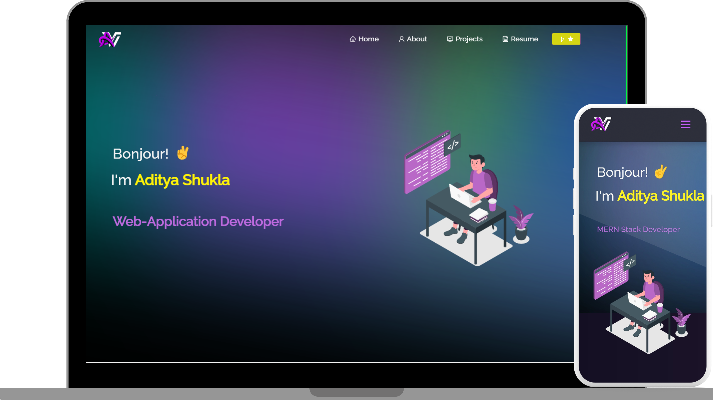

# Creater: VastavikAdi👑

<h1>Make sure to visit my Portfolio Website for the Demo</h1>
<a href="https://vastavikportfolio.vercel.app/" target="_blank" align="center"><b>Redirecting... to the Portfolio!</b>

<h2 align="center">
  Portfolio Website | VastavikAdi 
  <a href="https://vastavikportfolio.vercel.app/" target="_blank">VastavikAdi</a>
</h2>

  

 

 &nbsp;
 &nbsp;
 &nbsp;
 &nbsp;
 &nbsp;

<h3 align="center">
    🔹
    <a href="https://github.com/vastavikadi/Portfolio/issues">Report Bug</a> &nbsp; &nbsp;
    🔹
    <a href="https://github.com/vastavikadi/Portfolio/issues">Request Feature</a>
</h3>

# NOTE:
Fork the repo to modify and make changes of your own. Don't forget to give the credits to @VastavikAdi. Thanks!

#Built Using:
This is my personal portfolio website which has proper information of my github projects as well as my resume and technical skills.

This project was built using these technologies.

React.js
Node.js
Express.js
CSS3
VsCode
Vercel

# Features:
📖 Multi-Page Layout

🎨 Styled with React-Bootstrap and Css with easy to customize colors

📱 Appealing with Modern UI

# Getting Started:
Clone down this repository. You will need node.js and git installed globally on your machine.

🛠 Installation and Setup Instructions
Installation: npm install

In the project directory, you can run: npm start

Runs the app in the development mode.
Open http://localhost:3000 to view it in the browser. The page will reload if you make edits.

# Usage Instructions:
Open the project folder and Navigate to /src/components/.
You will find all the components used and edit the information according to your needs.

# Show your support
Give a star 🌟 to the repo and follow for more content like this!

# Vastavik Portfolio
